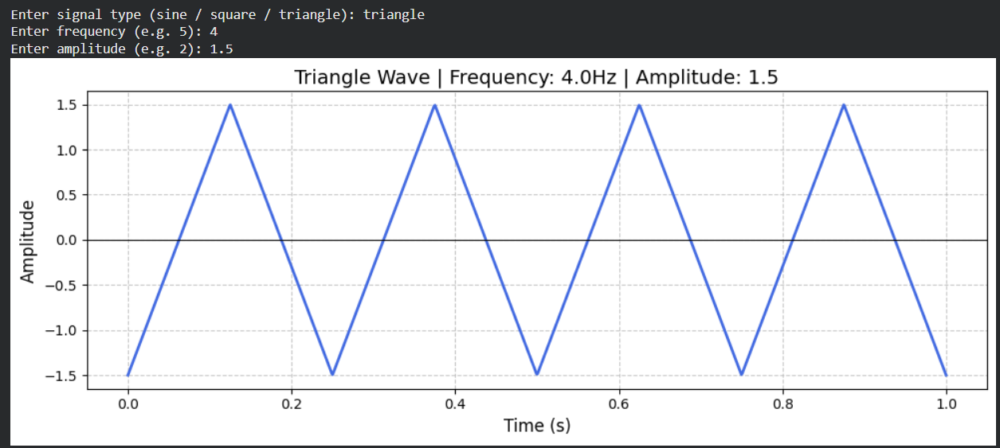

# Signal Visualizer 

A Python tool that generates and visualizes different types of signals — 
built as a pre-college project before starting ECE at VIT Vellore.

## Signals Supported
- Sine Wave
- Square Wave
- Triangle Wave

## What You Can Control
- Signal type
- Frequency (Hz)
- Amplitude

## How To Run
Open the notebook in Google Colab and run the cell.
Enter your preferred signal type, frequency, and amplitude when prompted.

## Why I Built This
Signals & Systems is a core subject in ECE. I built this to get an 
intuitive feel for how signals behave before studying them formally.

## Tools Used
- Python
- NumPy
- Matplotlib

## Sample Output

